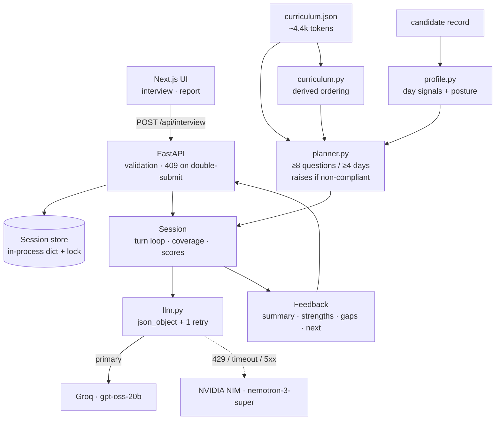

# The Interview Agent — Design Document

The deliverable specified by `RESEARCH_PROMPT.md` §7, written after the system was built
and measured. Every number here came from running the code, not from estimation. Anything
that could not be verified is tagged `UNVERIFIED` and is not load-bearing.

---

## 1. Executive summary

An interviewer whose **judgement is code and whose voice is a model**. A deterministic
planner reads the candidate's 31-day cohort record, assigns each of the 31 days a status,
and emits an ordered plan of ≥8 questions across ≥4 days before any model is called —
`build_plan()` raises rather than return a non-compliant plan, so the hard requirements are
guaranteed by construction rather than requested in a prompt. The model phrases questions
and scores answers on four independent axes; it *proposes* follow-ups, and the plan decides
whether one is granted.

No vector database: `curriculum.json` measures ~4.4k tokens, so retrieval would be a moving
part buying nothing. No agent framework: an interview is a straight line through eight
slots. The curriculum graph is kept only because it measurably changes 15 of 160 questions.
Scoring separates `terminology` from `specificity`, which is what lets the agent catch a
candidate who has the vocabulary and nothing underneath — the single most interesting thing
an interview agent can do.

---

## 2. Problem analysis (§1)

### 2.1 What is actually being graded

Not the questions. **The judgement.** A list of thirty good questions about RAG is a
worksheet; anyone can generate it in one prompt. What distinguishes an interviewer is what
happens *after* the answer: recognising that "we implemented a production-grade RAG pipeline
with optimized embedding retrieval" contains no information, and asking for the chunk size.

This reading drives every decision below. Where a choice traded question *variety* for
assessment *quality*, quality won.

### 2.2 Capability decomposition

| Capability | What "good" means | How measured here |
|---|---|---|
| profile → plan | Targets what the record says is weak; never asks the same thing twice | Coverage floors asserted for all 20 candidates; plans differ per candidate |
| plan → question | Sounds like a person, unanswerable by definition-recall alone | Live inspection of generated questions |
| answer → assessment | Separates substance from vocabulary | `gap` = strong-persona score − bluffer score, benchmarked per model |
| assessment → next action | Probes when probing will help, moves on when it won't | Follow-up rate asserted per persona in `run_eval` |
| session → report | Every claim traceable to something said | Asserted: feedback must cite real curriculum days |

### 2.3 Hard requirements, and the mechanism that guarantees each

The distinction that matters: a *mechanism* still holds when the model misbehaves.

| Requirement | Mechanism (not a prompt) |
|---|---|
| Multi-turn conversational | `Session` object; one model call per turn |
| ≥8 questions, ≥4 days | `build_plan()` raises below the floor; the loop cannot end with slots unconsumed |
| Follow-ups from prior answers | `TurnResult.action`, gated by `_followup_is_working()` |
| Context maintained | Transcript in every prompt, elided from the middle past a 6000-char budget |
| Structured feedback | Pydantic `Feedback`, validated, one retry with the schema attached |
| The HTTP endpoint | `POST /api/interview`, request/response shapes exactly per the spec |

### 2.4 Rubric mapping

The published rubric was not available to us, so these are inferred axes. Every major
decision is mapped to the one it targets — decisions that map to nothing were cut.

| Inferred axis | What earns it here |
|---|---|
| Requirement compliance | Coverage floors as code guarantees; spec-exact request/response; `/health` |
| Technical depth | Four-axis scoring with bluff detection; curriculum graph that changes 15/160 questions; model bench on our own task |
| UX | Visible interview plan with per-question reasoning; the report screen; named wait states |
| Creativity | Bluff detection; probing a skipped day *through* a later day that depends on it |
| Code quality | Domain logic importable without a server; eval runs free and offline; CI + secrets scan |
| Demo robustness | Cross-provider fallback verified against a genuinely exhausted primary |

### 2.5 Where the field will converge, and the three differences

The median submission: one LLM call in a loop with the curriculum in the system prompt,
questions chosen by the model, generically encouraging feedback, a template chat UI. It will
work, and it will be indistinguishable from thirty others.

Three things that are visibly different, all verified:

1. **Bluff detection.** `terminology` scored separately from `specificity`. Live: a
   jargon-dense answer scored `correctness 1, depth 1, specificity 0, terminology 4`, was
   flagged, and the agent refused to advance until given a concrete parameter.
2. **A visible plan.** Every question carries a plain-English reason, shown in the UI before
   it is asked. The reasoning is auditable rather than asserted.
3. **Feedback that declines to flatter.** A live run produced *"no answer demonstrated the
   required depth or specificity, so no strengths can be highlighted."*

---

## 3. API contract (verbatim from `technical-spec.md`)

```
POST /api/interview
```

No authentication. State is maintained via `sessionId`.

```json
// 1. Start
{ "sessionId": "abc-123", "candidate": { ...candidate.json } }
// -> { "reply": "Welcome. Let's begin your interview.", "done": false }

// 2. Each turn
{ "sessionId": "abc-123", "message": "..." }
// -> { "reply": "...", "done": false }

// 3. End
// -> { "reply": "Interview completed.", "done": true,
//      "feedback": { "summary": "...", "strengths": [], "gaps": [], "next": [] } }
```

`summary` string; `strengths`, `gaps`, `next` string arrays.

**Ambiguities and the readings chosen.**

| Ambiguity | Reading |
|---|---|
| Spec never says when `done` flips | When the plan's last slot is consumed. Not model discretion. |
| Additional response fields not addressed | A `meta` object is added for the UI. Spec fields are untouched; a spec-only client is unaffected. |
| No error envelope defined | FastAPI's `{"detail": ...}` with real status codes (400/409/422/503). |
| `candidate` on later requests | Ignored; the session already holds it. |
| Unknown `sessionId` with no candidate | 400. Silently starting a fresh interview would hide client bugs. |

---

## 4. Open-source source log (§2)

Everything below was fetched and read. **Structure and conventions only — no application
logic was copied from any of these**, because Stage 2 authenticity review scans for imported
codebases.

### Interviewer agents

| Project | Stars / License | Taken | Rejected & why |
|---|---|---|---|
| [IliaLarchenko/Interviewer](https://github.com/IliaLarchenko/Interviewer) | 119★ Apache-2.0 | Confirms env-var model abstraction (`LLM_TYPE`/`LLM_URL`/`LLM_NAME` ≈ our `LLM_BASE_URL`/`LLM_MODEL`) | Speech-first; STT/TTS out of scope |
| [yizucodes/interview-agent](https://github.com/yizucodes/interview-agent) | 9★ **educational-use only** | Nothing — licence is not permissive | Its ChromaDB RAG (1000/200 chunking) exists because project docs are unbounded; our curriculum is 4.4k tokens, so copying it would be strictly worse |
| [FoloUp](https://github.com/FoloUp/FoloUp) | 1.2k★ MIT | Next.js + Tailwind app layout | Question generation is one LLM call over a job description with no coverage guarantee. Its Postgres session persistence is genuinely better than our in-memory store — logged as a limitation, not adopted, since persistent accounts are out of scope |

### Orchestration — compared on state/checkpointing, which is the crux

| Project | Stars / License | Verdict |
|---|---|---|
| [LangGraph](https://github.com/langchain-ai/langgraph) | 39.2k★ MIT | Checkpointers give durable execution and resumption across failures. Real value for long-running branching graphs; our workflow is 8 sequential slots in one process. **Rejected**: a state framework on top of a `for` loop. |
| [Pydantic AI](https://github.com/pydantic/pydantic-ai) | 19.1k★ MIT | Type-safe, model-agnostic, durable execution. Closest call of the three. **Rejected**: we already use Pydantic directly for validation, which is the part we actually needed. |
| CrewAI / Agno / Mastra / DSPy | — | **Rejected** on the same ground: multi-agent role abstractions for a single-agent problem. |

### Evaluation

| Project | Stars / License | Verdict |
|---|---|---|
| [promptfoo](https://github.com/promptfoo/promptfoo) | 24.1k★ MIT | Excellent side-by-side model comparison and red-teaming. **Rejected**: Node-based, and our bench must exercise the app's own planner, prompt, and parser — a YAML harness cannot score a persona *through* our pipeline. |
| DeepEval (Apache-2.0), Ragas (Apache-2.0) | — | DeepEval is pytest-shaped for generic metrics; Ragas is RAG-specific and we have no RAG. **Rejected.** |

### Adaptive assessment

| Project | Stars / License | Verdict |
|---|---|---|
| [pyBKT](https://github.com/CAHLR/pyBKT) | 273★ MIT | Bayesian Knowledge Tracing needs **sequential observations per skill** to estimate learn/guess/slip. Our candidates have ~10 missions with *one* observation each. **Rejected: not estimable on this data** — a hard mathematical reason, not a preference. The `attempts` count is the usable signal, and the planner uses it directly. |

---

## 5. Techniques and papers (§3)

### 5.1 Retrieval — decided by measurement

**`curriculum.json` = ~4.4k tokens. Largest candidate profile = ~300 tokens.** The entire
corpus fits in one prompt. **Decision: no retrieval, no vector database.** Runner-up:
structured/SQL-over-JSON lookup — lost because a Python dict already is that.

### 5.2 Inference-time techniques

| Technique | Decision |
|---|---|
| Structured outputs | **Adopted** as `json_object` + parse + one retry with the schema attached. Provider-specific `json_schema` rejected: open-weight endpoints support it inconsistently. |
| Worked JSON example | **Adopted, then fixed.** First-try validity went 0–1/5 → 15/15 and median latency roughly halved. But the example's concrete numbers **anchored the scorer** — every model rated the bluffer exactly 2.0. Placeholders (`<integer 0-5>`) moved gpt-oss-20b's gap 1.0 → 3.88. |
| Prompt caching | **Shaped for, not relied on.** Groq [documents](https://console.groq.com/docs/prompt-caching) automatic prefix caching at 50% off with cached tokens exempt from rate limits. `UNVERIFIED`: responses from this account carry no `prompt_tokens_details.cached_tokens` field, so no hit could be confirmed. The prompt is prefix-stable anyway because it costs nothing. |
| Curriculum in prompt | **Decided by measurement** against the 200k tokens/day cap: full text ~5016 tok/turn → 39 turns/day (≈2 interviews before lockout); index + current day ~2293 → 87; current day only ~1893 → 105. Shipped the middle option — the index buys cross-day awareness the gap-bridging needs. |
| Multi-model routing | **Rejected.** The saving is real but small at our volume, and it doubles the surfaces that can fail live. Same-model-different-provider fallback was the better spend. |
| Cursor "Mixture of Kittens" | **Rejected, fetched before judging.** [It is](https://cursor.com/blog/mixture-of-kittens) a fused GPU kernel for MoE *training* on GB300 NVL72 hardware. Infrastructure-level; nothing transfers to an app calling a hosted API. |

### 5.3 Papers

| Paper | What we use |
|---|---|
| **Lost in the Middle: How Language Models Use Long Contexts** — Liu, Lin, Hewitt, Paranjape, Bevilacqua, Petroni, Liang. TACL 2023. [arXiv:2307.03172](https://arxiv.org/abs/2307.03172) | Models use the start and end of a context far better than the middle. Directly shapes prompt order: durable instructions first, the answer being scored last, transcript in the middle. |
| **Judging LLM-as-a-Judge with MT-Bench and Chatbot Arena** — Zheng et al. NeurIPS 2023 D&B. [arXiv:2306.05685](https://arxiv.org/abs/2306.05685) | Documents position, verbosity, and self-enhancement bias; >80% human agreement for strong judges. Verbosity bias is why `specificity` is scored separately — length must not buy a score. |
| **AI Conversational Interviewing** — Wuttke, Aßenmacher, Klamm, Lang, Würschinger, Kreuter. 2024/2025. [arXiv:2410.01824](https://arxiv.org/abs/2410.01824) | LLM interviewers produce data comparable to human-led interviews, with adherence to the guide as the risk. Supports keeping the guide (the plan) outside the model. |
| **Evaluating LLM-based Agents for Multi-Turn Conversations: A Survey** — Guan, Wang, Bian, Zhu, Lou, Xiong. 2025. [arXiv:2503.22458](https://arxiv.org/abs/2503.22458) | Names memory/context retention as a distinct evaluation dimension — the transcript budget assertion in `run_eval` exists because of it. |
| **Conversational Education at Scale (WikiHowAgent)** — Pei, Ye, Sun, Deng, Hindriks, Wang. 2025. [arXiv:2507.05528](https://arxiv.org/abs/2507.05528) | Teacher/learner/manager/evaluator split with rubric-based quality metrics. We collapse the roles into one call but keep the rubric-based evaluation. |
| **Is Passive Expertise-Based Personalization Enough?** — Siyan, Zhang, Maharaj, Shi, Li. 2025. [arXiv:2511.23376](https://arxiv.org/abs/2511.23376) | Passive profile-based personalization helps but is insufficient; recommends combining active and passive. **Our system is currently purely passive** — recorded as an open question in §11, not papered over. |

### 5.4 Graph engineering (§3d)

**Rejected**, with reasons: agent swarms (externalise parallel experiment search — we have
one candidate over ~10 sequential turns); commit-DAG lineage (research lineage across
hundreds of runs); cross-session memory (out of scope); LLM-driven KG construction (the
curriculum is already typed JSON — nothing to extract).

**Kept, because it earns its place with a number.** `curriculum.json` encodes no
prerequisite edges — only 8 modules with ordered day ranges — so ordering is *derived in
code*, never inferred by a model. A skipped day is probed **through the nearest later day
the candidate actually completed**, because asking someone to explain a day they were absent
for only confirms they were absent.

> **The graph redirects a question for 11 of 20 candidates (15 of 160 questions),** reported
> by `run_eval` on every run. Standing instruction: if it ever reaches zero, delete it.

Live: CAND-011 (skipped Day 7, Embeddings) was asked *"how you integrated the retrieval
system with the conversation memory in your final healthcare chatbot demo"* — a Day 31
question unanswerable without Day 7, which never mentions the skip. Known limitation: 5 of
the 15 bridges land on Day 31, the catch-all when a record is sparse.

The source document for this framing is an [independent synthesis
note](https://drive.google.com/file/d/1-GOg0kxcp8tx1BMUECMj2yJq6JYGmfhb/view) whose own
cover states it is *"not affiliated with Andrej Karpathy and Anthropic — and not endorsed."*
It is not a Karpathy paper and is not cited as one. Its useful frame — *each architecture
externalises a different bottleneck* — is used in §7.2.

**Graphify** ([Apache-2.0](https://github.com/rhanka/graphify)): dev-time code knowledge
graph for coding assistants, not a runtime component. Skipped — this repo is 40 files.

---

## 6. Model strategy (§4)

Model IDs read from each provider's live `/models` endpoint, never from memory. Deprecated
Groq IDs (`qwen3-32b`, `llama-4-scout`, `kimi-k2`) excluded per the
[deprecation notice](https://console.groq.com/docs/deprecations). Candidates spanned five
families: OpenAI open-weight, Meta, Alibaba, NVIDIA, Google, DeepSeek.

Benchmarked on **our own task** — the app's real prompt, planner, and parser — because no
public leaderboard answers "does this model's scorer separate substance from vocabulary?"

| Model | Provider | gap ↑ | bluff flagged | JSON 1st try | p50 |
|---|---|---|---|---|---|
| **openai/gpt-oss-20b** | Groq | **3.56** | 3/3 | 15/15 | 4.5s |
| nvidia/nemotron-3-super-120b-a12b | NVIDIA NIM | 3.34 | 3/3 | 12/15 | 2.7s |
| llama-3.3-70b-versatile | Groq | 2.00 | 3/3 | 15/15 | 0.51s |

`gap` = strong-persona score − bluffer score. **Every model scored the prompt-injection
persona 0/5**, so that defence is a property of the prompt, not the model.

**Chosen: `openai/gpt-oss-20b` primary, `nvidia/nemotron-3-super-120b-a12b` fallback.**
Runner-up `llama-3.3-70b-versatile` is ~9× faster and would win on latency alone, but scores
the bluffer 2.33 against gpt-oss-20b's 1.0 — the more gullible interviewer, which is the
wrong thing to trade away in an assessment tool.

**Fallback is cross-provider, and this was learned the hard way.** The first implementation
rotated between the three supplied Groq keys; the 429 body names an *organization*, so all
three share one 200k/day allowance and rotation bought nothing. Verified against a genuinely
exhausted primary: the interview continued on NVIDIA NIM. The trigger set covers rate
limits, connection errors, timeouts and 5xx — a live interview died on `APIConnectionError`
before the last of those was added.

**Secrets:** `scripts/check_secrets.py` runs in CI and as a pre-commit hook, with
provider-specific patterns and an allowlist so `.env.example` stays usable. Verified: clean
on 40 tracked files, exit 1 on a planted key.

**Breeth** is an [intent-aware memory layer](https://www.thebreeth.com/), not a model
provider — an earlier draft of the research prompt misidentified it and the correction is
recorded there. Not adopted at runtime: cross-session memory is out of scope, and its
`cognitive_pattern` / `why_connected` primitives are already implemented locally as
`Posture` and `PlannedQuestion.reason` in ~40 lines with no network call and no candidate
data leaving the process.

---

## 7. System design (§5)

### 7.1 Architecture



### 7.2 The interview loop

**Single agent with a deterministic planner.** Using the "what does this architecture
externalise?" frame: our bottleneck is neither iteration nor parallel search — it is
**guaranteeing coverage while adapting**. That is externalised by a *plan object*, not by
more agents. A multi-agent split (interviewer / evaluator / planner) was rejected because
the planner is not a model at all, and merging assessment with phrasing into one call halves
per-turn latency.

**Plan derivation.** Each of 31 days gets a status; base priorities are `failed` 100 >
`struggled` 90 > `skipped` 80 > `mastered` 55 > `unknown` 30, adjusted by day type
(`AI_CORE`/`SHIP_IT` +12, `SETUP` −25) and by posture.

Posture comes from `missionsFirstTry / missionsCompleted` — the strongest signal in this
dataset (CAND-018 is 31/31; CAND-017 is 1/31):

| Posture | Rate | Effect |
|---|---|---|
| fast-grasp | ≥0.70 | Clean passes → `tradeoff` intent at `stress` difficulty. Harder, not easier. |
| steady | 0.35–0.70 | Verify before escalating |
| persistent-grinder | <0.35 | Clean passes are the *least* trustworthy data they have: +15 priority, verification over breadth |

**Note on data honesty:** the mission list is a *sample* — CAND-001 lists 10 missions but
reports 30 completed — so days absent from it are `unknown`, never `skipped`. The
interviewer is explicitly forbidden from accusing someone of skipping a day it has no record
of.

**Coverage guarantee.** Pass 1 spreads one question per day and per module; pass 2 fills by
priority to `MAX_PER_DAY`. Then `build_plan()` **raises** unless ≥8 questions, ≥4 days, ≥3
modules. Verified for all 20 candidates.

**Follow-up policy.** The model proposes `followup` or `advance`. It is overridden when: 2
follow-ups already spent on this slot; `MAX_TURNS` approaching; or **the previous follow-up
did not improve the score**. That last rule was added after watching a live model re-ask a
near-identical question twice when a candidate repeated a non-answer.

**Difficulty.** Planned rung on `warmup → core → deep → stress`, then ±1 by the mean of the
last three scores (≥4 up, ≤2 down).

**Bluff detection.** `bluffing = (terminology − specificity) ≥ 2 and specificity ≤ 2`.
Defined as a *gap*, not an absolute threshold: an earlier version required `terminology ≥ 4`
and silently never fired on models that rate a plainly jargon-heavy answer 2/5. The gap
definition restored 3/3 detection on every model tested.

### 7.3 State model

Typed `Session` / `Turn` / `Assessment` / `PlannedQuestion` (Pydantic). Stored in an
in-process dict behind a lock, with TTL and LRU eviction, plus a per-session lock so a
double-submit gets 409 rather than two interleaved turns.

**What breaks on restart:** in-flight interviews are lost. Accepted — the problem statement
puts persistent accounts and long-term history out of scope, and Redis behind the same three
methods is a small change if that ever stops being true. Consequence: **one worker**.

### 7.4 Context management

| Segment | Treatment |
|---|---|
| Persona + scoring guide + 31-day index | Stable prefix, byte-identical every call (~928 tokens) |
| Candidate context, plan reason, current day detail | Rebuilt per turn |
| Transcript | Full to 6000 chars, then **elided from the middle**, keeping the first 2 and last 6 exchanges |
| Candidate's answer + response schema | Last, where attention is strongest |

Elision beats an LLM rolling summary here: summarising costs an extra call per turn and can
silently drop the detail an assessment rested on. Dropping whole exchanges is lossy in a way
that is *visible and stated*. Asserted in `run_eval`: a full interview stays at 4384 chars
against a 6000 budget.

### 7.5 Scoring and feedback

Four independent 0–5 axes — `correctness`, `depth`, `specificity`, `terminology` — validated
by Pydantic, one retry with the JSON Schema attached on failure.

Hallucinated praise is prevented by instruction (*"only list a strength if the scores
support it… say so plainly rather than inventing praise"*) and verified by behaviour: a live
run returned *"no answer demonstrated the required depth or specificity, so no strengths can
be highlighted."*

Anti-gaming: candidate answers are delimited in `<candidate_answer>` tags and framed as data;
the system prompt refuses instructions arriving inside them. The adversarial persona in
`run_eval` keeps it honest — verified 0/5 on every model benchmarked.

### 7.6 Failure modes

| Failure | Mitigation | Verified by |
|---|---|---|
| Prompt injection in an answer | Delimited as data; system prompt refuses embedded instructions | Adversarial persona: 0/5 on all 8 models |
| Off-topic answer | Scored on merit, low score, plan advances regardless | Persona runs |
| Empty answer | `"(no answer given)"`, scored 0 | `silent` persona |
| 5k-word answer | Truncated at `ANSWER_CHAR_LIMIT` (6000 chars) | Code |
| Invalid JSON | One retry with schema attached, then 503 | Bench: 15/15 first-try after the schema fix |
| Unknown `sessionId` | 400 with a clear message | Live `curl` |
| Rate limit (429) | Fallback provider | Verified against an exhausted primary |
| Connection error / timeout / 5xx | Same fallback path | Added after a live interview died on `APIConnectionError` |
| Concurrent turns, one session | Non-blocking lock → 409 | `run_eval` |
| Transcript growth | Middle-elision budget | `run_eval` |

### 7.7 Eval plan

`eval/run_eval.py` — offline by default (it once silently consumed a day's token allowance),
`--live` to use a provider. Personas: strong, weak, bluffer, silent, adversarial. Asserts:
coverage floors for all 20 candidates; graph-bridge direction; ≥8 questions and ≥4 days per
run; all four feedback fields populated; **follow-up rate** (weak/bluffer/silent must draw a
probe; strong must not be interrogated on every answer); **feedback cites only real
curriculum days**; transcript bounded; concurrent turn refused; strong > weak; bluffer <
strong; injection scores no 5/5 and does not end the interview early.

That day-citation assertion immediately caught the *offline stand-in* citing no days — the
test double was not structurally representative, and was fixed.

`eval/bench_models.py` compares models on the same task. An earlier version parsed responses
itself with no retry and reported every model as 0.0 — it was measuring its own missing retry
loop. It now goes through `app.llm.structured_ex`, the same path the app uses.

### 7.8 API layer

`POST /api/interview` (spec-exact), `GET /health` (model, provider, offline flag, live
session count — for Stage 1 uptime checks), `GET /api/candidates` (demo seed data so the
demo never depends on a judge pasting a valid profile). Validation via Pydantic at the trust
boundary; CORS verified for both the GET and the POST preflight. **Not streaming** — see §11.

### 7.9 Repo structure

Single repo — the submission takes exactly one URL, and splitting would put the judged
artifacts behind two links.

```
app/                    FastAPI backend; importable without a server
  main.py               POST /api/interview, /health, /api/candidates
  schemas.py            wire contract (spec verbatim) + internal types
  curriculum.py         curriculum load, derived ordering, cached digest
  profile.py            candidate record -> day signals + posture
  planner.py            the plan; owns the coverage guarantees
  interviewer.py        turn loop, prompts, follow-up policy, report
  llm.py                OpenAI-compatible client, retry, provider fallback
  store.py              in-memory session store with TTL + LRU
eval/
  run_eval.py           personas + assertions; free and offline
  bench_models.py       cross-provider model comparison on this task
  bench_results.json    recorded output
scripts/
  check_secrets.py      leaked-key scanner
  pre-commit            git hook wrapper
web/                    Next.js 16 + Tailwind v4 + motion
  app/page.tsx          phase machine: pick -> interview -> report
  components/           CoveragePanel, Transcript, Composer, Report, CandidatePicker
  lib/api.ts            typed client
data/                   curriculum.json, candidates.json
.github/workflows/ci.yml  secrets scan -> eval -> frontend build
Dockerfile, render.yaml   backend deploy (single worker, deliberately)
README.md  PROMPTS.md  DESIGN.md  RESEARCH_PROMPT.md  LICENSE  .env.example
```

Conventions: FastAPI's documented `app/` layout; Next.js `app/` router; `eval/` and
`scripts/` as flat top-level dirs (the layout IliaLarchenko/Interviewer uses for `api/`,
`ui/`, `tests/`). Domain logic imports without a server running — which is what makes both
the eval and the Live Steer round cheap.

### 7.10 Deployment

Backend as a container (`Dockerfile`, `render.yaml`), not a serverless function: scoring
calls take seconds and serverless request timeouts are a real constraint. `healthCheckPath:
/health`. Single worker, because sessions are in-process. Frontend is a static Next.js build
on Vercel with `NEXT_PUBLIC_API_URL` pointed at the backend.

Cold start is the known tradeoff on free tiers — a judge opening the demo after idle waits
for a container spin-up. Mitigation: hit `/health` before any demo. Fallback host if the
primary fails: any container host (Fly.io, Railway) from the same Dockerfile.

### 7.11 Live Steer readiness

Domain logic is importable without HTTP, so a feature can be built and tested against
`run_eval` without a server. The three most likely surprise features and the exact file each
touches:

| Surprise feature | Files | Why it is small |
|---|---|---|
| Add a scoring dimension | `schemas.py` (add field), `interviewer.py` (`SCORING_GUIDE`, `TURN_SCHEMA_EXAMPLE`), `Report.tsx` (`AXES`) | Dimensions are data; the report renders whatever `dimensions()` returns |
| Second interview mode (e.g. rapid-fire) | `planner.py` (`build_plan(size=...)` already parameterised) | Plan size and floors are constants, not hardcoded |
| Expose per-question timing | `schemas.py` (`Turn`), `interviewer.py` (stamp), `meta()` | `meta` is a free-form dict the UI already consumes |

---

## 8. UI/UX (§6)

Two screens. Both built on the principle that the reasoning should be visible, not asserted.

### 8.1 Interview screen

```
┌──────────────────────┬────────────────────────────────────────┐
│ INTERVIEW PLAN  3/8  │  Wendy Foster · Marketing Manager  End │
│ ▓▓▓▓▓▓░░░░░░░░░░░░░  ├────────────────────────────────────────┤
│                      │                                        │
│ [grinder][core][3/8] │  Day 7                                 │
│                      │  How did you generate and store        │
│ ● Day 7   verify     │  embeddings for the knowledge base?    │
│   Embeddings         │                                        │
│   Passed after 4     │              We implemented a          │
│   attempts. Check    │              production-grade RAG…     │
│   whether the        │                                        │
│   difficulty was     │  Day 7                                 │
│   understood or      │  Which model, what dimensionality,     │
│   worked around.     │  and what did the PCA plot show?       │
│ ○ Day 12  gap        │                                        │
│ ○ Day 22  depth      │  ● ● ●  Assessing your answer          │
│ ○ Day 28  tradeoffs  │         against Day 7…                 │
│                      ├────────────────────────────────────────┤
│                      │ [ Specifics beat vocabulary…    ] Send │
└──────────────────────┴────────────────────────────────────────┘
```

### 8.2 Feedback report

```
INTERVIEW COMPLETE
Wendy Foster · 8 questions across 8 curriculum days

   2.4 / 5.0

   Correctness  ▓▓▓▓░░░░░░░░  1.9    Was it technically true?
   Depth        ▓▓▓░░░░░░░░░  1.4    Mechanism, or definition?
   Specificity  ▓▓░░░░░░░░░░  1.1    Real systems, numbers?
   Terminology  ▓▓▓▓▓▓▓░░░░░  3.6    Vocabulary fluency

   ⚠ Vocabulary outran substance. Terminology 3.6 vs specificity 1.1 —
     the right words were there, the detail behind them often was not.

SUMMARY / STRENGTHS / GAPS / NEXT       BY CURRICULUM DAY
                                        Day 7  Embeddings  [bluff] ▓▓░ 1.2
```

### 8.3 Component inventory

| Component | States |
|---|---|
| `CandidatePicker` | idle · loading · error (API unreachable) · disabled-while-starting |
| `CoveragePanel` | pending / current / covered per question; current expands to show its reason |
| `Transcript` | empty · populated · thinking · error |
| `Composer` | idle · disabled-while-thinking · empty-input |
| `Report` | complete; bluff callout conditional on a ≥2 terminology−specificity gap |

### 8.4 Motion

| Trigger | Duration / easing |
|---|---|
| Message enter | 350ms, `cubic-bezier(.32,.72,0,1)`, opacity + 8px rise |
| Coverage bar | 500ms width |
| Current-question reason expand | 300ms height + opacity |
| Thinking dots | 1.4s pulse, 160ms stagger |
| Score reveal | 700ms bar fill, 80ms stagger per axis |
| Overall score | 450ms at 200ms delay, scale 0.94 → 1 |

All of it is decorative, so `prefers-reduced-motion: reduce` collapses every animation to
0.001ms globally.

### 8.5 Accessibility and theming

Keyboard-only operable; focus returns to the input whenever the interviewer finishes
speaking; new turns announced via `aria-live="polite"` on the transcript container (not on
the input, which would fight the focus); errors in `role="alert"`. Theme tokens are defined
on bare `:root` for light and redefined under both `prefers-color-scheme: dark` and
`:root[data-theme="dark"]` — **no colour is defined only inside a media query.**

Latency UX: scoring takes seconds, so the wait state names the work — *"Assessing your answer
against Day 12"* — rather than showing an unlabelled spinner.

### 8.6 21st.dev

Searched the catalogue for chat/transcript and score/metric components. Reviewed: [Agent
Chat](https://21st.dev/@serafimcloud/components/agent-chat), [Chat
Messages](https://21st.dev/@nexus-ui/components/chat-messages), [Streaming
Text](https://21st.dev/@ddoemonn/components/streaming-text), [Animated Radial
Chart](https://21st.dev/@isaiahbjork/components/animated-radial-chart), [Progress Metric
Card](https://21st.dev/@makviesainte/components/progress-metric-card).

**Not installed**, for two honest reasons. They are shadcn-registry components and this app
is Tailwind-only — adopting one pulls in `components.json`, CVA, and Radix for a five-file
UI. And the catalogue's chat components are demo-shaped (iPhone frames, sequential reveal
animations for marketing pages) rather than product-shaped; our two most important surfaces
— a panel that explains *why* each question was chosen, and a report that flags bluffing —
have no catalogue equivalent because they are domain-specific.

---

## 9. Build order

Each phase is independently demoable and was committed separately.

| Phase | Content | Parallelisable |
|---|---|---|
| 1 | Scaffold, fixtures, spec | — |
| 2 | `curriculum.py`, `profile.py`, `schemas.py` | Backend A |
| 3 | `planner.py` + coverage floors | Backend A |
| 4 | `interviewer.py`, `llm.py`, `store.py` | Backend B |
| 5 | `main.py` — spec endpoint | Backend B |
| 6 | `run_eval.py` personas | Either; unblocks everyone |
| 7 | `web/` two screens | Frontend, once phase 5 lands |
| 8 | `bench_models.py` + model choice | Backend A |
| 9 | CI, secrets, deploy | Either |
| 10 | README, PROMPTS, DESIGN | Everyone |

Phases 2–3 and 4–5 are the natural two-person split; the frontend can start against the
contract as soon as phase 5 exists.

---

## 10. Risks

| Risk | Mitigation | Residual |
|---|---|---|
| Free-tier daily cap during judging | Cross-provider fallback; prompt sized to 87 turns/day | A sustained burst still exhausts both |
| Cold start on a free container host | `/health` warm-up before demoing | First judge visit after idle is slow |
| In-memory sessions | Documented; Redis is a small change | Redeploy drops in-flight interviews |
| Scorer variance run to run | 3 reps in the bench; gap is a difference so drift partly cancels | Single-run scores are not precise |

## 11. Open questions

1. **Passive-only personalization.** [arXiv:2511.23376](https://arxiv.org/abs/2511.23376)
   finds passive profile-based personalization insufficient alone and recommends combining
   active and passive. Ours is purely passive — the candidate cannot say "actually, ask me
   about deployment." A one-line control would address it and is not built.
2. **We do not stream.** §6 asks for a streaming answer; the backend returns complete replies
   and the UI shows a named wait state instead. Honest gap. SSE from FastAPI would fix it,
   but scoring must complete before the next question exists, so only the reply text could
   stream — a smaller win than it appears.
3. **Bridge concentration.** 5 of 15 graph bridges land on Day 31 because the capstone is the
   catch-all downstream day for sparse records. A per-module bridge preference would spread
   them.
4. **Prompt caching unconfirmed.** The prompt is prefix-stable and would benefit if Groq's
   documented caching applies, but no `cached_tokens` field is returned on this account, so
   the 50% saving is claimed by neither the code nor this document.
